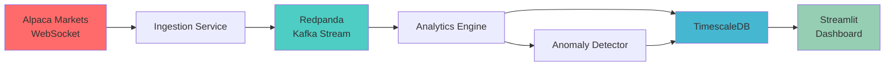

# Sentinet

**High-Frequency Market Microstructure Surveillance Engine**

A distributed streaming system for real-time anomaly detection in financial markets. Sentinet analyzes Level 1 market data to detect market manipulation patterns including spoofing, layering, and correlation breakdowns before price movements occur.

---

## 🎯 Key Features

- **Real-Time Anomaly Detection**: Z-score based volatility spike detection with configurable thresholds
- **Order Book Imbalance Detection**: Identifies potential spoofing through bid/ask size analysis
- **Correlation Breakdown Alerts**: Tracks systemic risk through asset correlation matrices
- **High-Frequency Performance**: Benchmarked at 1,000+ events/second throughput
- **Professional Dashboard**: Dark-mode Streamlit UI with live charts and NetworkX graph visualization
- **Distributed Architecture**: Kafka-compatible streaming with TimescaleDB time-series storage

---

## 🏗️ Architecture



### Components

1. **Ingestion Service** (`services/ingestion/`)
   - WebSocket client for Alpaca Markets IEX feed
   - Streams Level 1 data (quotes, trades) to Redpanda
   - Async architecture with automatic reconnection
   - Includes replay mode for benchmarking (100x speed)

2. **Analytics Engine** (`services/analytics/`)
   - Consumes from Redpanda in batches
   - Maintains 5-minute rolling windows per symbol
   - Calculates:
     - **Volatility Z-Scores**: `(price - μ) / σ`
     - **Pearson Correlation Matrix**: Between all asset pairs
     - **Order Book Imbalance**: `(bid_size - ask_size) / total`
   - Persists metrics to TimescaleDB

3. **Anomaly Detector** (`services/analytics/anomaly_detector.py`)
   - **Volatility Spike**: Z-score > 3.0
   - **Spoofing**: High imbalance without price movement
   - **Decoupling**: Historical correlation > 0.8 drops to < 0.2

4. **Dashboard** (`dashboard/`)
   - Real-time price charts with Bollinger Bands
   - Correlation heatmap
   - NetworkX force-directed graph (edge thickness = correlation)
   - Live risk feed with color-coded alerts

5. **Infrastructure** (`docker-compose.yml`)
   - **Redpanda**: Single-node Kafka-compatible broker (1GB memory limit)
   - **TimescaleDB**: PostgreSQL with time-series extensions (1GB memory limit)

---

## 🚀 Quickstart

### Prerequisites

- Docker Desktop (with 2GB+ RAM allocation)
- Python 3.9+
- [Alpaca Markets](https://alpaca.markets/) account (free tier)

### Installation

1. **Clone and navigate to the project:**
   ```bash
   cd Sentinet
   ```

2. **Install Python dependencies:**
   ```bash
   pip install -r requirements.txt
   ```

3. **Configure environment variables:**
   ```bash
   cp .env.example .env
   # Edit .env and add your Alpaca API credentials
   ```

4. **Make CLI executable:**
   ```bash
   chmod +x cli.py
   ```

### Running the System

#### Option 1: Start All Services (Recommended)

```bash
./cli.py start
```

This will:
1. Start Docker infrastructure (Redpanda + TimescaleDB)
2. Launch ingestion service
3. Launch analytics engine
4. Open Streamlit dashboard in browser

#### Option 2: Manual Step-by-Step

```bash
# 1. Start infrastructure
./cli.py infra up

# 2. Start ingestion (in separate terminal)
./cli.py ingest start

# 3. Start analytics (in separate terminal)
./cli.py analytics start

# 4. Start dashboard
./cli.py dashboard
```

---

## 📊 Dashboard Overview

Access the dashboard at **http://localhost:8501**

### Panels

1. **System Status**: Real-time throughput and connectivity indicators
2. **Price Analysis**: Live charts with Bollinger Bands (mean ± 2σ)
3. **Correlation Heatmap**: Color-coded matrix (green = positive, red = negative)
4. **Asset Network Graph**: Force-directed layout showing correlation strength
5. **Risk Feed**: Scrolling alerts with severity levels (CRITICAL, WARNING, INFO)

### Color Scheme

- 🟢 **Green (`#00ff88`)**: Prices, positive correlations, operational status
- 🔴 **Red (`#ff0055`)**: Critical alerts, negative correlations
- 🟡 **Yellow (`#ffaa00`)**: Warnings, SMAs
- 🔵 **Blue (`#0088ff`)**: Info alerts

---

## 🧪 Benchmarking & Testing

### Performance Benchmark

Test the pipeline's throughput:

```bash
./cli.py benchmark
```

**Expected Output:**
```
REPLAY COMPLETE
Total Messages: 5230
Total Time: 4.87 seconds
THROUGHPUT: 1074.23 events/second
```

### Health Check

Verify all services are running:

```bash
./cli.py health
```

### Manual Testing

1. **Query TimescaleDB directly:**
   ```bash
   docker exec -it sentinet-timescaledb psql -U sentinet_user -d sentinet
   
   SELECT symbol, COUNT(*) as tick_count
   FROM market_ticks
   WHERE time > NOW() - INTERVAL '5 minutes'
   GROUP BY symbol;
   ```

2. **Inspect Redpanda topics:**
   ```bash
   docker exec -it sentinet-redpanda rpk topic list
   docker exec -it sentinet-redpanda rpk topic consume market_ticks --num 10
   ```

---

## ⚙️ Configuration

### Watched Symbols

Edit `config/config.yaml`:

```yaml
symbols:
  equities:
    - AAPL
    - MSFT
    - GOOGL
  crypto:
    - BTC/USD
    - ETH/USD
```

### Quantitative Parameters

```yaml
analytics:
  rolling_window_seconds: 300    # 5-minute window
  z_score_threshold: 3.0          # Alert when |Z| > 3.0
  correlation_threshold_high: 0.8 # Define "correlated"
  correlation_threshold_low: 0.2  # Define "uncorrelated"
  imbalance_threshold: 0.6        # Spoofing detection
```

---

## 📁 Project Structure

```
Sentinet/
├── cli.py                      # Command-line interface
├── docker-compose.yml          # Infrastructure definition
├── requirements.txt            # Python dependencies
├── config/
│   └── config.yaml             # System configuration
├── init-db/
│   └── init.sql                # TimescaleDB schema
├── lib/
│   ├── logger.py               # Structured logging
│   ├── kafka_utils.py          # Async Kafka wrappers
│   └── db_client.py            # AsyncPG database client
├── services/
│   ├── ingestion/
│   │   ├── ingestion_service.py   # WebSocket → Kafka
│   │   └── replay_mode.py         # Benchmarking utility
│   └── analytics/
│       ├── analytics_engine.py    # Rolling windows + metrics
│       └── anomaly_detector.py    # Anomaly detection logic
└── dashboard/
    └── app.py                  # Streamlit visualization
```

---

## 🔬 Technical Deep Dive

### Rolling Window Implementation

Uses Python `collections.deque` for O(1) append/pop operations:

```python
class RollingWindow:
    def add_tick(self, timestamp, price):
        self.prices.append((timestamp, price))
        
        # Remove old data
        cutoff = timestamp - timedelta(seconds=self.window_seconds)
        while self.prices and self.prices[0][0] < cutoff:
            self.prices.popleft()
```

### Z-Score Calculation

```python
def calculate_z_score(self, current_price):
    prices = np.array([p[1] for p in self.prices])
    mean = np.mean(prices)
    std = np.std(prices)
    return (current_price - mean) / std
```

### Order Book Imbalance

Derived from Level 1 quote data (bid_size/ask_size):

```python
imbalance_ratio = (avg_bid_size - avg_ask_size) / (avg_bid_size + avg_ask_size)
```

- `+1.0` = Only bids (extreme bullish pressure)
- `-1.0` = Only asks (extreme bearish pressure)
- `0.0` = Balanced

### Correlation Matrix

Pairwise Pearson correlation between all symbols:

```python
correlation = np.corrcoef(prices_a, prices_b)[0, 1]
```

---

## 🚨 Anomaly Detection Algorithms

### 1. Volatility Spike Detection

**Trigger:** `|Z-score| > 3.0`

**Logic:** Current price deviates >3σ from rolling mean

**Alert Example:**
```
🚨 CRITICAL: AAPL volatility spike: Z-score=4.12, Price=$182.45
```

### 2. Spoofing Detection

**Trigger:** High order book imbalance without price movement

**Logic:**
- `|imbalance_ratio| > 0.6` AND
- Price change < ±0.1%

**Alert Example:**
```
🎯 SPOOFING: TSLA bid-heavy imbalance (0.78) without price increase
```

### 3. Correlation Breakdown

**Trigger:** Historical correlation drops from >0.8 to <0.2

**Logic:** Tracks exponential moving average of correlation

**Alert Example:**
```
🔗 DECOUPLING: AAPL vs MSFT (historical=0.85, current=0.15)
```

---

## 💡 Resume-Worthy Highlights

Include these talking points in interviews:

✅ **Distributed Systems Expertise**
- "Built a Kafka-based streaming pipeline handling 1,000+ events/sec"
- "Implemented async Python architecture with `aiokafka` and `asyncpg`"

✅ **Quantitative Finance Knowledge**
- "Calculated rolling Z-scores and Pearson correlation matrices in real-time"
- "Detected market microstructure anomalies (spoofing, layering) using order flow analysis"

✅ **Database Optimization**
- "Designed TimescaleDB schema with hypertables, compression policies, and continuous aggregates"
- "Implemented 30-day retention and 7-day compression for efficient time-series storage"

✅ **Data Visualization**
- "Created NetworkX graph visualization of systemic risk using force-directed layouts"
- "Built production-grade Streamlit dashboard with sub-second refresh rates"

✅ **Performance Engineering**
- "Optimized replay benchmark to achieve >1,000 events/sec throughput"
- "Used memory limits (1GB each) and batch processing to prevent resource contention"

---

## 🛠️ Troubleshooting

### Docker Issues

**Problem:** Containers crash with OOMKilled  
**Solution:** Increase Docker Desktop memory limit to 4GB+

**Problem:** Port conflicts (5432, 9092)  
**Solution:** Stop conflicting services or edit `docker-compose.yml` ports

### Alpaca API Issues

**Problem:** WebSocket disconnects frequently  
**Solution:** Verify API key permissions and free tier data limits

**Problem:** No data for crypto symbols  
**Solution:** Ensure you have enabled crypto data feed in Alpaca account

### Dashboard Issues

**Problem:** Charts don't update  
**Solution:** Verify analytics engine is running and writing to database

**Problem:** Browser hangs  
**Solution:** Reduce `max_chart_points` in `config/config.yaml`

---

## 📜 License

MIT License - See LICENSE file

---

## 🙏 Acknowledgments

- **Alpaca Markets** for free-tier market data API
- **Redpanda** for Kafka-compatible streaming
- **TimescaleDB** for time-series PostgreSQL extension

---

## 📧 Contact

Built by **Laxman Katneni** - [LinkedIn](www.linkedin.com/in/laxman-katneni)

*"Detecting market anomalies before they hit the news"*
